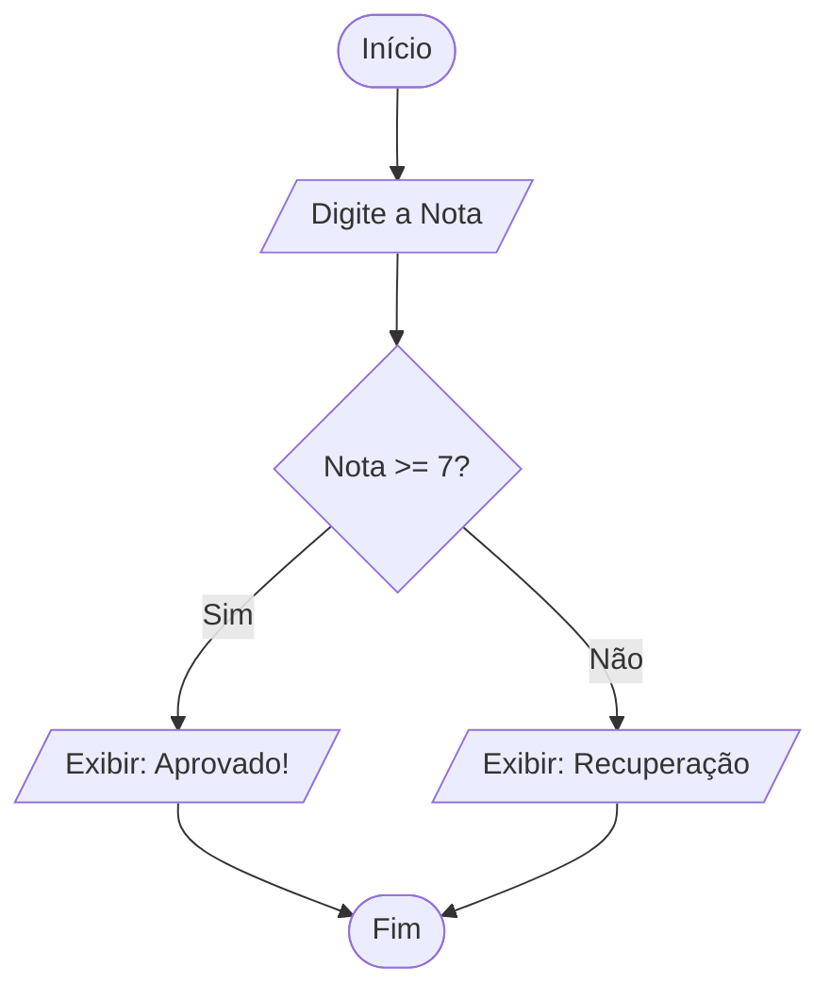
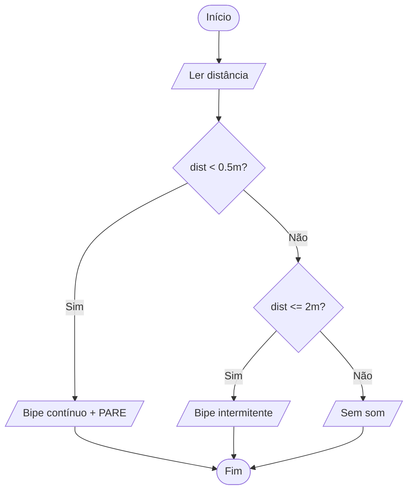

# 📐 Aula 02: O Mapa da Mina (Fluxogramas e Tomada de Decisão)

Se na aula passada aprendemos a "receita do bolo", hoje vamos aprender a desenhar o mapa que o computador segue. Como desenvolvedor, garanto: **um código bem desenhado é um código que funciona de primeira.**

---

## 🗺️ O que é um Fluxograma?

Um fluxograma é a representação visual de um algoritmo. É a ponte entre a ideia na sua cabeça e o código no editor. Por que usar?

* **Clareza:** Identifica erros de lógica antes mesmo de programar.
* **Documentação:** Ajuda outros desenvolvedores a entenderem seu raciocínio.
* **Padronização:** Usa símbolos mundiais que qualquer programador (da China ao Brasil) entende.

---

## 🏗️ A Caixa de Ferramentas (Simbologia ANSI)

Para desenhar fluxogramas, não usamos qualquer forma. Cada símbolo tem um significado semântico específico:

| Símbolo                           | Nome         | Função                                                        |
| --------------------------------- | ------------ | ------------------------------------------------------------- |
| **Terminal (Oval)**               | Início / Fim | Indica onde o processo começa e termina.                      |
| **Processamento (Retângulo)**     | Ação         | Cálculos, atribuições de valores ou operações internas.       |
| **Entrada/Saída (Paralelogramo)** | Dados        | Quando o programa lê algo do teclado ou exibe na tela.        |
| **Decisão (Losango)**             | Condicional  | Uma pergunta (Sim/Não). Aqui o fluxo se divide.               |
| **Setas**                         | Fluxo        | Indicam a direção obrigatória que o "pensamento" deve seguir. |

---

## 🚦 A Estrutura de Decisão (O "Se" na Prática)

Na vida real, raramente seguimos uma linha reta. "Se chover, levo guarda-chuva; senão, vou de óculos de sol". No computador, chamamos isso de **Estrutura de Seleção**.

### Exemplo: Sistema de Média Escolar

Imagine um algoritmo que decide se um aluno foi aprovado (Média 7.0):



---

## 🛠️ Do Desenho ao Pseudocódigo

Veja como o fluxograma acima se traduz em lógica escrita (Portugol):

```
Algoritmo "Validador_de_Notas"
Var
    nota: real
Inicio
    Escreva("Informe a nota final: ")
    Leia(nota)

    Se (nota >= 7.0) entao
        Escreva("Status: APROVADO")
    Senao
        Escreva("Status: EXAME FINAL")
    FimSe
FimAlgoritmo
```

---

## 🔍 O "Pulo do Gato": Condições Compostas

E se tivermos mais de duas opções? Usamos o **Se-Senão-Se** (aninhamento).
*Exemplo: Se nota > 9 (Excelente), Senão se nota > 7 (Bom), Senão (Reprovado).*

!!! info "Dica de Sênior"
    Sempre verifique se todos os caminhos (setas) do seu fluxograma levam a um "Fim". Um caminho sem saída no fluxograma vira um *bug* de travamento no sistema.

---

## 🪜 Decisões em Faixas (Vários Intervalos)

Alguns problemas não têm só "sim ou não": eles têm **faixas de valores**. O **sensor de estacionamento** (Exercício 1) é o caso clássico — a resposta muda conforme a distância cai em cada intervalo. A técnica é encadear losangos, sempre indo **do mais restritivo para o mais amplo**:



!!! warning "A ordem dos testes importa"
    Se você perguntasse `dist <= 2m?` **antes** de `dist < 0.5m?`, uma distância de 0.3m cairia na faixa errada (pois 0.3 também é ≤ 2). Ao trabalhar com faixas, teste sempre o limite **mais apertado primeiro**.

---

## ⛓️ Decisões em Sequência vs. Decisões Aninhadas

Cuidado para não confundir duas situações que parecem iguais no desenho:

=== "Em sequência (independentes)"
    Uma decisão acontece **depois** da outra, e ambas sempre são avaliadas. É o caso do **filtro de foto** (Exercício 2): primeiro "Aplicar P&B?", depois "Postar agora?". Uma resposta não impede a outra.

=== "Aninhadas (dependentes)"
    A segunda decisão só é avaliada **dentro** de um dos caminhos da primeira. É o caso do **caixa eletrônico** (Exercício 3): só faz sentido perguntar "entregar as notas?" *depois* de confirmar que há saldo suficiente.

!!! tip "Como distinguir no fluxograma"
    Se os dois losangos estão em linha reta, um após o outro → **sequência**. Se um losango aparece *dentro* do ramo "Sim" (ou "Não") de outro → **aninhamento**.

---

## 📝 Desafios de Design de Lógica

??? abstract "Exercício 1: O Sensor de Estacionamento"
    Desenhe (ou descreva) o fluxo para um sensor de ré de um carro:

    - O sensor lê a distância.
    - **Se** a distância for menor que 0.5m: Tocar bipe contínuo e exibir "PARE".
    - **Se** estiver entre 0.5m e 2m: Tocar bipe intermitente.
    - **Senão**: Não emitir som.

??? abstract "Exercício 2: O Filtro de Foto"
    Crie a lógica para um filtro de foto:

    1. O usuário escolhe uma foto.
    2. O sistema pergunta: "Aplicar filtro P&B?"
    3. Se sim, transforma em cinza. Se não, mantém original.
    4. O sistema pergunta: "Postar agora?"
    5. Se sim, envia para o servidor. Se não, salva na galeria.

    *Dica: Use dois losangos de decisão em sequência.*

??? abstract "Exercício 3: O Caixa Eletrônico"
    Escreva o algoritmo para um saque:

    - Ler o `valor_saque`.
    - Verificar se o `valor_saque` é menor ou igual ao `saldo_disponivel`.
    - Se for, subtrair do saldo e entregar as notas.
    - Se não for, exibir "Saldo Insuficiente".

---

## 📚 Referências

- **FORBELLONE, A. L. V.; EBERSPÄCHER, H. F.** *Lógica de Programação.* 3. ed. Pearson, 2005. — Cap. 2 (Representação de algoritmos: fluxogramas e pseudocódigo).
- **MANZANO, J. A. N. G.; OLIVEIRA, J. F. de.** *Algoritmos: Lógica para Desenvolvimento de Programação de Computadores.* 28. ed. São Paulo: Érica, 2016. — Simbologia de fluxogramas.
- **ISO 5807:1985** — Norma internacional que padroniza os símbolos de fluxogramas de processamento de dados.
- Documentação do **Mermaid** (usado para desenhar os diagramas desta apostila): [mermaid.js.org](https://mermaid.js.org).
- Wikipédia (PT): [Fluxograma](https://pt.wikipedia.org/wiki/Fluxograma).

---

!!! tip "Próxima Parada"
    Agora que você já sabe desenhar o caminho, vamos aprender a guardar informações nesse trajeto. Prepare-se para a aula de **Variáveis e Operadores Matemáticos** e faça a **[Lista 02](../listas/02-lista.md)**!
