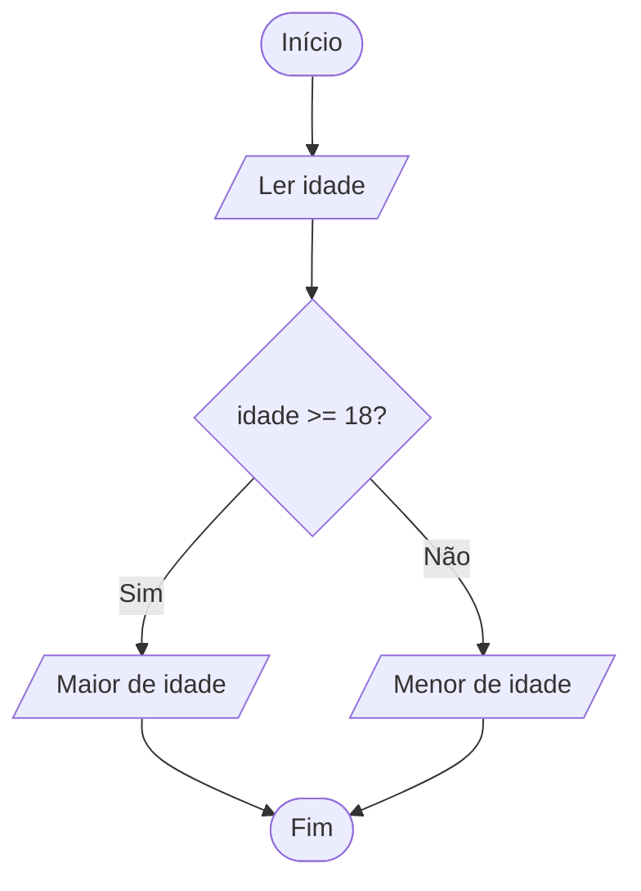

# 🚦 Aula 07: Estruturas de Controle — IF / ELSE

Chegamos ao coração da lógica: fazer o programa **escolher caminhos**. Um sistema que não decide nada é só uma calculadora. Com o `Se` (if) e o `Senao` (else), seu código ganha inteligência.

---

## 🧭 A Estrutura `Se` Simples

Executa um bloco **apenas se** a condição for verdadeira.

```
Se (condicao) entao
    // executa se verdadeiro
FimSe
```

Exemplo:

```
Se (saldo >= valor_compra) entao
    Escreva("Compra aprovada!")
FimSe
```

---

## ↔️ A Estrutura `Se ... Senao`

Escolhe entre **dois** caminhos.

```
Algoritmo "Maioridade"
Var
    idade: inteiro
Inicio
    Escreva("Digite sua idade: ")
    Leia(idade)

    Se (idade >= 18) entao
        Escreva("Maior de idade")
    Senao
        Escreva("Menor de idade")
    FimSe
FimAlgoritmo
```



---

## 🪜 O Encadeamento `Se ... Senao Se` (múltiplas faixas)

Quando existem **várias possibilidades**, encadeamos as condições. Só entra em uma faixa se as anteriores forem falsas.

```
Algoritmo "Boletim"
Var
    media: real
Inicio
    Leia(media)

    Se (media >= 9.0) entao
        Escreva("Conceito A - Excelente")
    Senao Se (media >= 7.0) entao
        Escreva("Conceito B - Aprovado")
    Senao Se (media >= 5.0) entao
        Escreva("Conceito C - Recuperação")
    Senao
        Escreva("Conceito D - Reprovado")
    FimSe
FimAlgoritmo
```

!!! info "A ordem importa!"
    Sempre teste do mais restritivo para o mais amplo. Se você testasse `media >= 5` primeiro, uma nota 9 cairia na faixa errada, pois 9 também é maior que 5.

---

## 🧩 Condições Compostas (revisão)

Lembre-se dos operadores lógicos da Aula 04. Você pode combinar testes:

```
Se (idade >= 18) e (possui_habilitacao) entao
    Escreva("Pode dirigir")
Senao
    Escreva("Não pode dirigir")
FimSe
```

---

## ⚠️ Erros Clássicos

!!! danger "Cuidado"
    - Confundir `=` (comparação) com `<-` (atribuição).
    - Esquecer o `FimSe`.
    - Testar faixas na ordem errada no encadeamento.
    - Colocar a segunda condição fora de um `Senao` quando ela deveria ser exclusiva (gerando testes redundantes).

---

## 📝 Desafios

??? abstract "Exercício 1: Par ou Ímpar"
    Leia um número inteiro e informe se ele é **par** ou **ímpar** (dica: `numero % 2 = 0`).

??? abstract "Exercício 2: Maior de Três"
    Leia três números diferentes e informe qual é o **maior**.

??? abstract "Exercício 3: Classificação de IMC"
    Calcule o IMC (peso / altura²) e classifique: abaixo de 18.5 (abaixo do peso), entre 18.5 e 24.9 (normal), entre 25 e 29.9 (sobrepeso), 30 ou mais (obesidade).

??? abstract "Exercício 4: Login Simples"
    Leia usuário e senha. Se usuário for "admin" **e** senha for "1234", exiba "Acesso liberado"; senão, "Acesso negado".

---

!!! tip "Próxima Parada"
    Quando há **muitas opções fixas** (como um menu), o `Se` encadeado fica cansativo. Existe algo melhor: o **SWITCH-CASE**. Resolva a **[Lista 07](../listas/07-lista.md)**!
