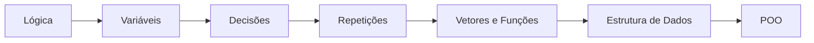

# 🚀 Aula 15: POO na Prática — Herança e Polimorfismo

Na aula anterior conhecemos classes, objetos e encapsulamento. Agora fechamos a disciplina com os dois pilares que dão à POO seu verdadeiro poder de reaproveitamento: **Herança** e **Polimorfismo**.

---

## 🧬 Herança (reaproveitar código)

Herança permite que uma classe **herde** atributos e métodos de outra. A classe "mãe" é a **superclasse**; a "filha" é a **subclasse**, que ganha tudo da mãe e ainda pode adicionar o que é próprio dela.

*Exemplo: todo `Cachorro` e todo `Gato` são `Animal`. Ambos têm `nome` e sabem `comer()`, mas cada um faz `emitirSom()` do seu jeito.*

```
Classe Animal
    nome: caractere

    Procedimento comer()
    Inicio
        Escreval(nome, " está comendo")
    FimProcedimento

    Procedimento emitirSom()
    Inicio
        Escreval("Som genérico de animal")
    FimProcedimento
FimClasse

Classe Cachorro herda de Animal
    Procedimento emitirSom()   // reescreve o método da mãe
    Inicio
        Escreval("Au au!")
    FimProcedimento
FimClasse

Classe Gato herda de Animal
    Procedimento emitirSom()
    Inicio
        Escreval("Miau!")
    FimProcedimento
FimClasse
```

!!! info "Relação 'é um'"
    Use herança quando a frase "X **é um** Y" fizer sentido: "Cachorro é um Animal" ✅. "Carro é um Motor" ❌ (o carro *tem* um motor — isso é composição, não herança).

---

## 🎭 Polimorfismo (muitas formas)

Polimorfismo significa que **o mesmo comando** pode se comportar de formas diferentes dependendo do objeto. Chamamos `emitirSom()` — e cada animal responde à sua maneira.

```
Var
    a1: Animal
    a2: Animal
Inicio
    a1 <- novo Cachorro()
    a2 <- novo Gato()

    a1.emitirSom()   // Au au!
    a2.emitirSom()   // Miau!
```

Repare: ambos são tratados como `Animal`, mas cada um executa **sua própria versão** do método. É isso que permite escrever código genérico e flexível.

---

## 🏛️ Os 4 Pilares da POO (resumo)

=== "1. Abstração"
    Representar o essencial do mundo real no código, ignorando detalhes irrelevantes.

=== "2. Encapsulamento"
    Proteger os dados internos, expondo apenas métodos controlados (Aula 14).

=== "3. Herança"
    Reaproveitar atributos e comportamentos de uma classe em outra.

=== "4. Polimorfismo"
    O mesmo método assume comportamentos diferentes conforme o objeto.

---

## 🛠️ Exemplo Integrador: Sistema de Funcionários

```
Classe Funcionario
    nome: caractere
    salarioBase: real

    Funcao calcularSalario(): real
    Inicio
        Retorne salarioBase
    FimFuncao
FimClasse

Classe Gerente herda de Funcionario
    Funcao calcularSalario(): real   // polimorfismo
    Inicio
        Retorne salarioBase + (salarioBase * 0.20)   // +20% de bônus
    FimFuncao
FimClasse

Var
    f: Funcionario
    g: Gerente
Inicio
    f <- novo Funcionario()
    f.nome <- "Ana"
    f.salarioBase <- 2000

    g <- novo Gerente()
    g.nome <- "Bruno"
    g.salarioBase <- 5000

    Escreval(f.nome, ": R$ ", f.calcularSalario())   // 2000
    Escreval(g.nome, ": R$ ", g.calcularSalario())   // 6000
```

---

## 🎓 Encerramento da Disciplina

Você começou sem saber o que era um algoritmo e agora modela sistemas orientados a objetos. Esse é o caminho:



!!! quote "Para levar para a vida"
    Programar é uma habilidade que se constrói praticando. Continue resolvendo problemas, publicando no GitHub e, principalmente, **errando e corrigindo**. É assim que todo desenvolvedor evolui.

---

## 📝 Desafios Finais

??? abstract "Exercício 1: Formas Geométricas"
    Crie uma classe `Forma` com o método `calcularArea()`. Crie as subclasses `Circulo` e `Quadrado`, cada uma com sua própria fórmula de área (polimorfismo).

??? abstract "Exercício 2: Veículos"
    Crie a classe `Veiculo` (atributos: marca, velocidade) e as subclasses `Carro` e `Moto`. Sobrescreva um método `descrever()` em cada uma.

??? abstract "Exercício 3: Sistema de Biblioteca (Projeto)"
    Modele as classes `Livro` (título, autor, disponível) e `Usuario` (nome). Crie métodos `emprestar()` e `devolver()` que alterem a disponibilidade do livro (encapsulamento + regras de negócio).

---

!!! tip "E agora?"
    Chegou a hora de aplicar tudo numa linguagem de mercado (Java, Python ou C#). O pensamento lógico que você construiu aqui é **transferível para qualquer linguagem**. Bons códigos! Não esqueça da **[Lista 15](../listas/15-lista.md)**.
